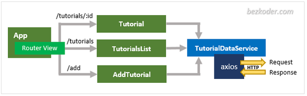
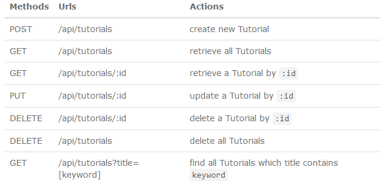

# vue-3-crud 


## App Overview

This App uses the REST-Api of my Repo "spring-boot-one-to-many" !!!






App runs on:
http://localhost:8081/  

<br>


## App setup
```
vue create vue-3-crud

--> choose Default ([Vue 3] babel, eslint)
```


### Install packages
```
npm install bootstrap@4.6.0 jquery popper.js
npm install vue-router@4
npm install axios
```

### Compiles and hot-reloads for development
```
npm run serve
```

### Compiles and minifies for production
```
npm run build
```

### Lints and fixes files
```
npm run lint
```


### Customize configuration
See [Configuration Reference](https://cli.vuejs.org/config/).
